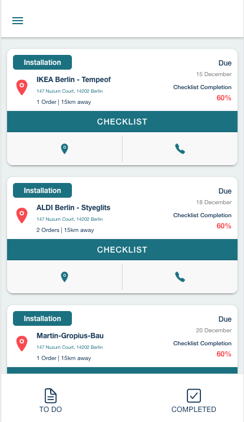
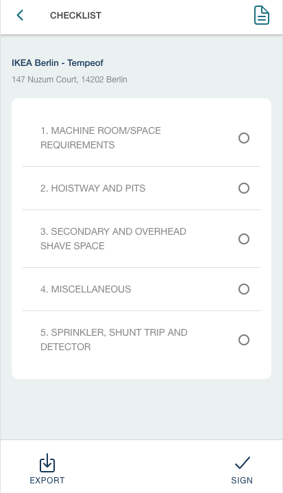
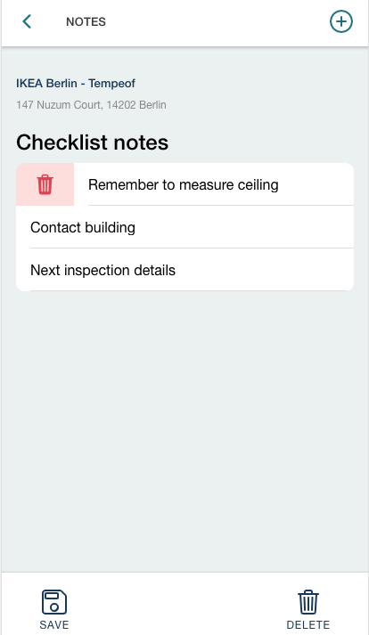

# Checklist App

The Mainteny Technician's Checklist App

*This project was part of a two week program with Mainteny. Our group consisted of Joakim Andersson, Carlos Chavez, Georg Ekeberg and Helari Sosi.*

# Installation and setup

### Install

Use yarn to install dependencies by running the following command in the server and client directories.

```bash
npm install
```

### Start the application

To start the frontend application

```bash
ionic serve
```

And in the backend directory

```bash
npm start
```

The frontend will now be accessible at http://localhost:8100/ and the backend will be accessible on http://localhost:1337/

## Visuals






